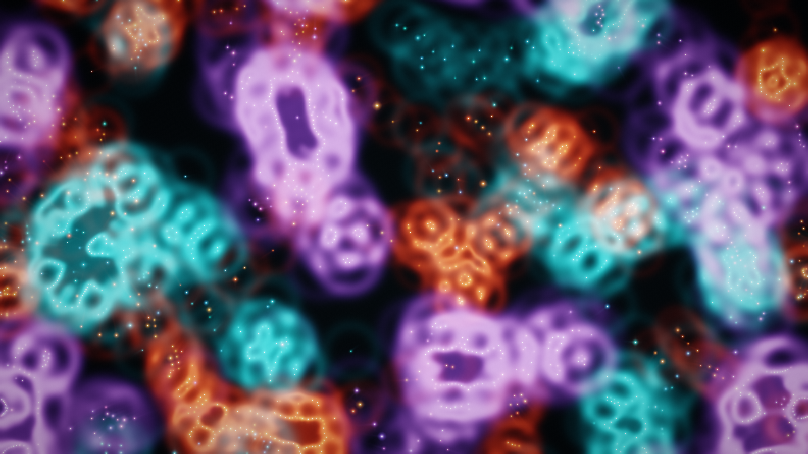

# Confluon

Confluon is an original generative audiovisual instrument. It brings three
deterministic particle populations together to compose long-form electronic music.
Each population forms its own structures while cyclic attraction and avoidance pull
them into encounters. Local crowding excites resonant voices, coherent movement opens
a shared drone, and changes in collective energy produce strikes and transitions.

Its deterministic Rust/WASM simulation drives both WebGPU visuals and Web Audio
sound. There is no sequencer and no separate audio-reactive animation: the image
and music are two views of one evolving state.

**Live:** [confluon.com](https://confluon.com/)



## What is here

- An energy-inspired, three-population particle model with distinct shell fields,
  cyclic cross-population sensing, close-range repulsion, and performance forces.
  A per-step pair list over a counting-sort grid reuses scratch storage across steps.
- Deterministic engine reproduction from an integer seed and fixed simulation
  timestep.
- A 2,000-particle field (adjustable from 600 to 4,096) initialised as 24 compact
  colonies. The WebGPU renderer accumulates every particle's shell kernel into a
  floating-point field texture, layers GPU-accumulated motion trails beneath growth
  contours and luminous particle cores in an HDR target, then finishes with bloom,
  ACES tone mapping, vignette, and grain. A cached-sprite Canvas 2D fallback
  preserves the same point-built image.
- An audible Web Audio harmonic field with six sustained voices, a formation choir
  whose up to eight voices pan to the screen positions of visible formations, sub
  foundation, filtered air, shimmer, sparse scale-locked tones, delay, a generated
  early-reflection and diffuse-tail reverb, tape-style saturation, compression,
  limiting, and an output meter.
- Pointer-aware organisms that startle at a poke or fast approach, investigate a
  still cursor, and keep a protected inner distance. Touch-friendly Gather, Orbit,
  and Divide gestures add deliberate sculpting, alongside seeding and resetting.
- URL-backed performance settings for ecology, flow, touch strength, halo, visual
  memory, tone, population, and level.
- Three featured starting scores—Still Choir, Tidal Assembly, and Ember Rift—offer
  deliberately contrasting seeds and settings without changing the deterministic
  state contract.
- A discreet control panel whose closed settings icon fades after 20 seconds and
  returns with the next pointer movement, screen press, key, or wheel interaction.
- An installable PWA shell with versioned offline caching and an explicit update
  prompt, so a running performance is never replaced underneath the player.
- Privacy-scrubbed production diagnostics, an in-instrument feedback form, and a
  quiet support link. Diagnostics and anonymous Web Analytics are build-time
  opt-ins and remain absent when their deployment configuration is not present.
- Native Rust tests for determinism, stability, bounded metrics, interaction, and
  particle-count conservation, plus browser smoke tests for graphics, audio,
  controls, touch, offline use, privacy, and error routes.

## Play locally

Requires Node.js 22+, `wasm-pack`, and stable Rust with the
`wasm32-unknown-unknown` target.

```sh
npm ci
npm run dev
```

Open the local URL printed by Vite. The field appears immediately; the first click,
touch, key press, or wheel gesture starts Web Audio. The control icon in the top-left
opens the compact performance controls. It fades while closed and idle; an open panel
remains visible.

Run the complete verification gate with:

```sh
npm run check
```

Exercise the built instrument in Chromium, including audio startup, PWA metadata,
privacy, and 404 behavior, with:

```sh
npx playwright install chromium
npm run smoke
```

Prepare and verify the self-contained itch.io HTML5 package and listing artwork with:

```sh
npm run build:itch
npm run capture:itch
npm run smoke:itch
```

The archive, checksummed manifest, cover, page background, and screenshot are written
under the ignored `output/itch/` directory. The exact listing copy, metadata, theme,
QA sequence, and seven-day measurement contract live in
[`docs/ITCH_LISTING.md`](docs/ITCH_LISTING.md).

## Project layout

- `src/` contains the deterministic Rust simulation and narrow WASM facade.
- `web/` contains the browser composition root, renderers, audio graph, score codec,
  and viewport projection.
- `public/` contains the article pages, PWA shell, icons, and social preview.
- `scripts/` contains verification, build finalization, browser smoke tests, and
  video production.
- `docs/` records the creative, research, architecture, and capture contracts.

`pkg/`, `dist/`, `output/`, `renders/`, and `target/` are generated locally and are
ignored by git.

## Produce video

Create a synchronized, share-ready video from a seed:

```sh
npm run video -- --seed 12345 --duration 30
```

The production helper records the WebGPU field and mastered audio together, then
encodes and verifies an H.264/AAC MP4. It supports landscape, square, 4:5 portrait,
9:16 story, 4K, and custom sizes; MP4 and WebM can be generated together:

```sh
npm run video -- \
  --seed 12345 \
  --duration 30 \
  --formats landscape,square,portrait,story \
  --containers mp4,webm
```

Each output includes a PNG preview and a JSON manifest with the engine revision,
seed, performance settings, canonical performance URL, browser and platform,
resolution, frame cadence, duration, and codecs. See
[Video production](docs/VIDEO_PRODUCTION.md) for format presets, codec choices, and
requirements.

## Deployment

Every passing push to `main` deploys the production build to Cloudflare Workers
through GitHub Actions:

<https://confluon.com>

The workflow builds and tests before deploying. Pull requests run the same checks but
never deploy. A manual production deployment can also be started from the repository's
Actions page. Local deployment is available to an authenticated operator with
`npm run deploy`. The former `confluon.tre.systems` and `geno-5.tre.systems`
hostnames, plus `www.confluon.com`, permanently redirect to the canonical domain
while preserving paths, query parameters, and shared seeds.

Production releases can provide these GitHub Actions secrets:

- `SENTRY_DSN` activates browser error reporting and Feedback.
  `SENTRY_AUTH_TOKEN`, `SENTRY_ORG`, and `SENTRY_PROJECT` enable release tagging and
  private source-map upload.
- `CLOUDFLARE_WEB_ANALYTICS_TOKEN` activates Cloudflare's cookieless performance
  beacon.
- `CLOUDFLARE_API_TOKEN` and `CLOUDFLARE_ACCOUNT_ID` authorize deployment.

Without the Sentry or analytics values the corresponding browser integration is a
no-op; Feedback stays hidden rather than presenting a dead control. Every deploy
candidate is dependency-audited, built, artifact-verified, and browser-smoked before
release, then the public hostname is smoked again after deployment.

See [Privacy](https://confluon.com/privacy) for the user-facing data boundary.

## Performance map

- Move a mouse or hovering pen through the field: nearby organisms notice it without
  needing a click. Fast movement alarms them; a still pointer draws their attention.
- Poke or click to make nearby organisms recoil. Hold or drag and the response moves
  from startle into the selected **Gather**, **Orbit**, or **Divide** gesture.
- Shift + drag: momentarily orbit without changing the selected mode.
- Option/Alt + drag: momentarily divide and open a cavity.
- Double click/tap: seed a compact 50-particle colony at the pointer.
- Hold `S`: move toward a quieter common state; release it to return to local
  negotiation, often provoking a transition.
- `R`: reset the current field to its starting state.
- `Space`: pause or resume.
- `G`, `O`, `D`: select Gather, Orbit, or Divide.

Append `?seed=12345` to the URL to start from a specific field.
Changing a performance setting records the complete configuration in the URL, so a
seed and its ecology, flow, look, tone, and selected gesture can be shared together.
Copy the browser address to share that complete starting state.

## Design documents

- [The field](https://confluon.com/field) — how the three-population
  energy system forms, senses, and responds.
- [The sound](https://confluon.com/sound) — how collective state becomes
  harmony, texture, space, and gesture.
- [How it is built](https://confluon.com/engineering) — the Rust/WASM,
  WebGPU, Web Audio, reproducibility, and production architecture.
- [Privacy](https://confluon.com/privacy) — what remains local and how
  optional diagnostics and feedback are handled.
- [Concept](docs/CONCEPT.md) — creative axes and musical mapping.
- [Architecture](docs/ARCHITECTURE.md) — simulation, render, and audio contracts.
- [Research basis](docs/RESEARCH.md) — what was learned from the Particle Lenia
  reference and what this implementation changes.
- [Video production](docs/VIDEO_PRODUCTION.md) — reproducible local capture and
  share-format exports.

## Contributing

Contributions are welcome. Read [CONTRIBUTING.md](CONTRIBUTING.md) for setup,
verification, and the determinism contract. Please use an issue to discuss a large
change before investing heavily in it.

Report suspected vulnerabilities privately through the process in
[SECURITY.md](SECURITY.md), not a public issue.

## Research basis and attribution

The model is informed by *Particle Lenia and the energy-based formulation* by
Alexander Mordvintsev, Eyvind Niklasson, and Ettore Randazzo. Their article describes
the radial field, growth, repulsion, local-energy dynamics, and an initial per-particle
sonification experiment. Confluon is an independent implementation and uses a
collective musical mapping; it includes no upstream code or creative assets.

- [Research article](https://google-research.github.io/self-organising-systems/particle-lenia/)
- [Interactive reference demo](https://znah.net/lenia/)
- [Reproducible notebook](https://github.com/google-research/self-organising-systems/blob/master/notebooks/particle_lenia.ipynb)

## License

Apache-2.0. See [LICENSE](LICENSE).
